# Documentación Proyecto 1 Grupo 2

# 📕 MyLibrary

## 📝 ÍNDICE
- [Documentación Sprint](#documentación-sprint)
    - [📌 Tablero Kanban](#tablero-kanban)
    - [📍 Sprints](#sprints)  
- [Modelo entidad relación](#modelo-entidad-relación)
- [Diagrama de caso de uso](#diagrama-de-caso-de-uso)
- [Diagrama de caso de uso de alto nivel](#diagrama-de-caso-de-uso-de-alto-nivel)
- [Diagrama de caso de uso expandido](#diagrama-de-caso-de-uso-expandido)

## 📃 Documentación Sprint

### 📌 Tablero Kanban

En este apartado se encuentra el desarrollo del tablero Kanban de Github, donde se puede ver el desarrollo de las tareas a lo largo del proyecto.

- Sprint Planning:
    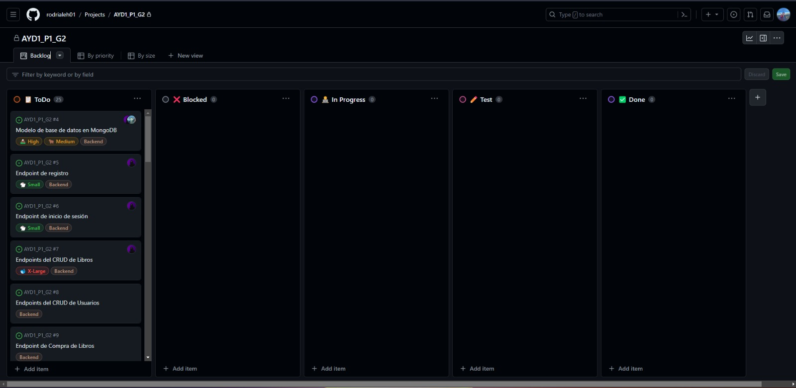
- Dailys Sprints:
    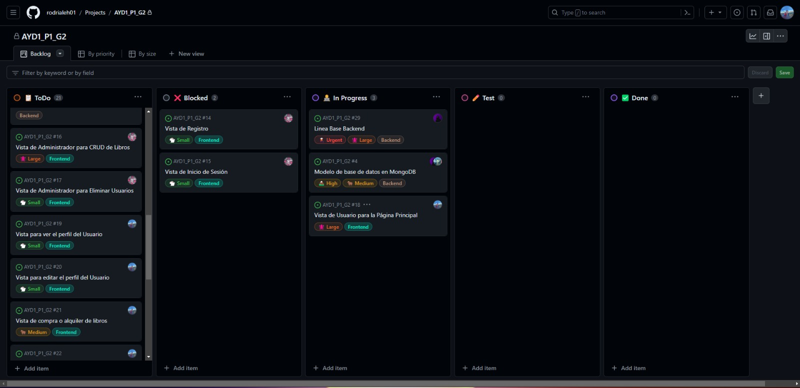
    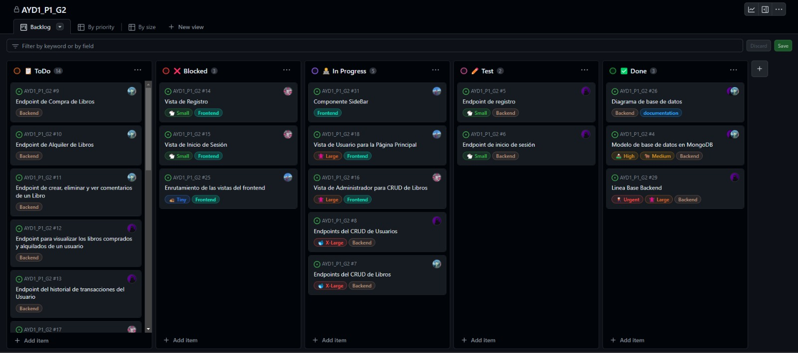
    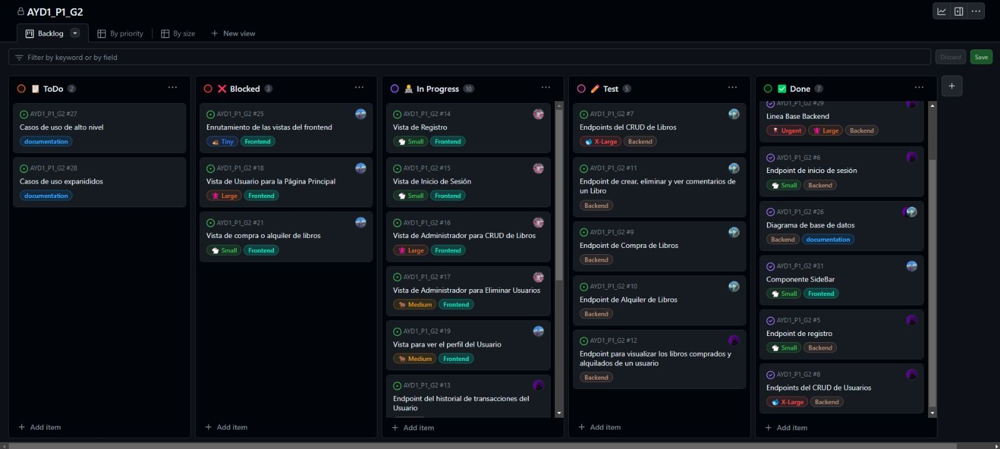
- Sprint Retrospective:
    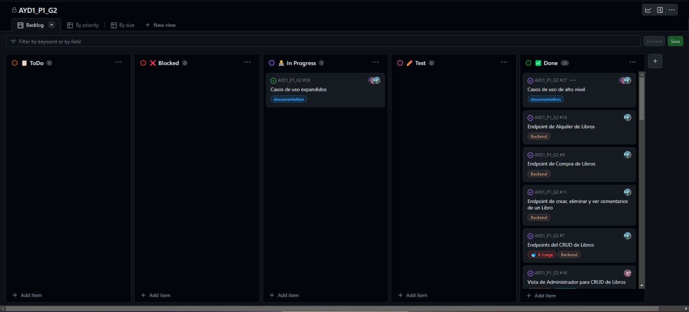

### 📍 Sprints

En este apartado se encuentra las grabaciones del desarrollo de los sprints a lo largo del proyecto.

[Link de la carpeta de los sprints del proyecto](https://drive.google.com/drive/folders/1M3uXQ7G3BFGp8JHneZMErmo0loB-Db1O?usp=sharing)

## Modelo entidad relación

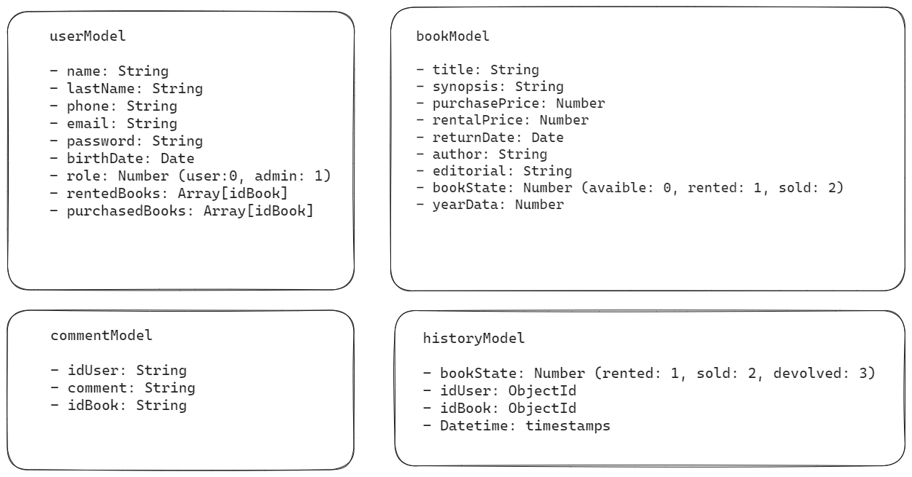

## Diagrama de caso de uso

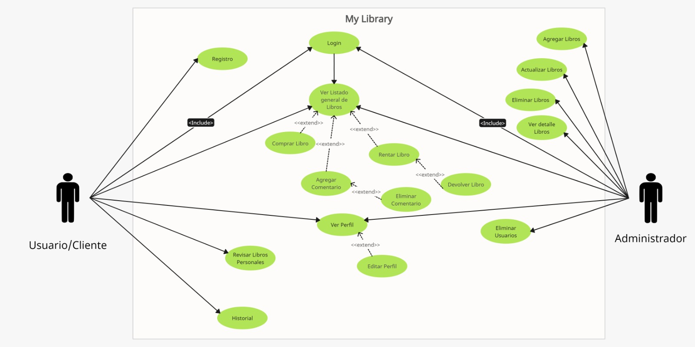

## Casos de alto nivel

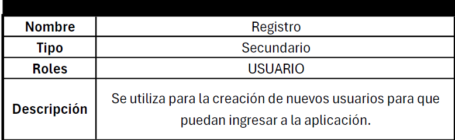

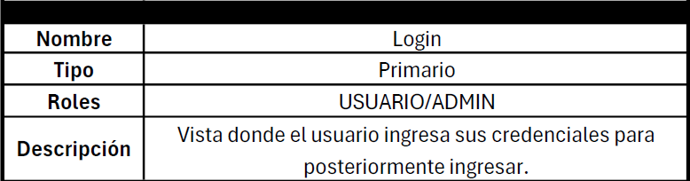

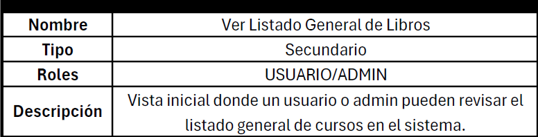

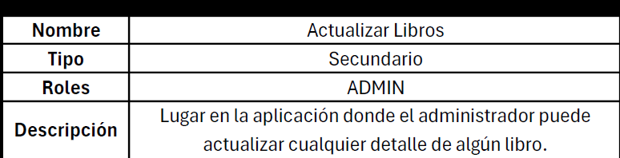

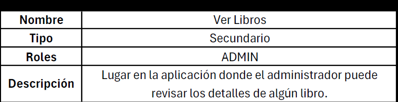

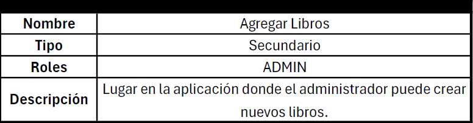

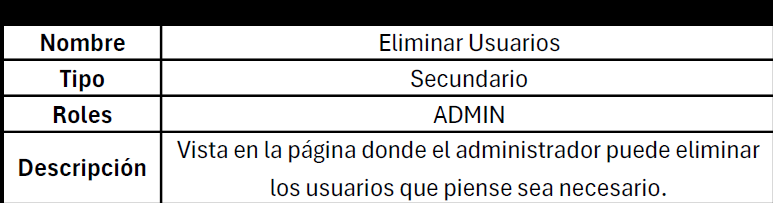

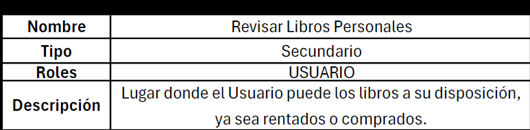

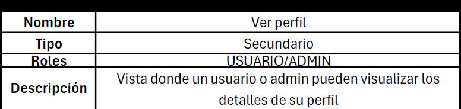

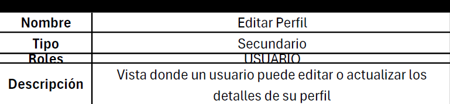

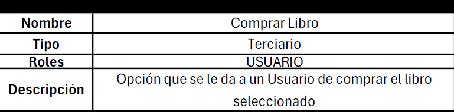

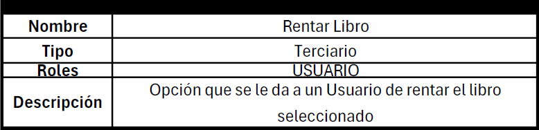

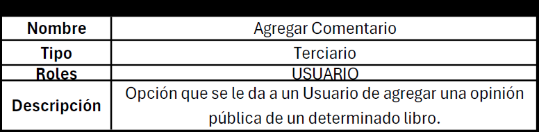

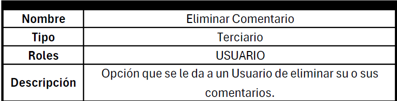

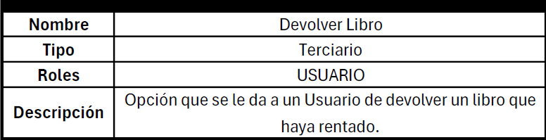

## Casos de uso expandido

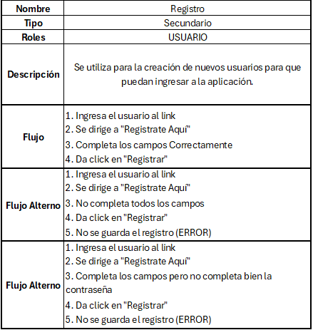

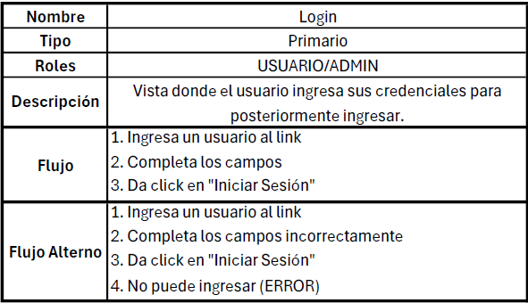

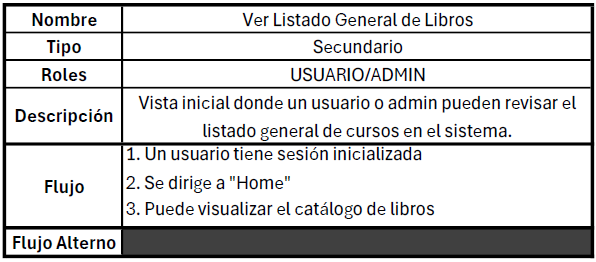

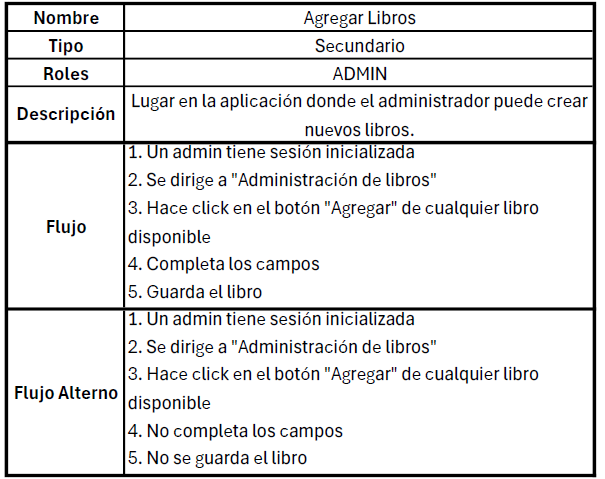

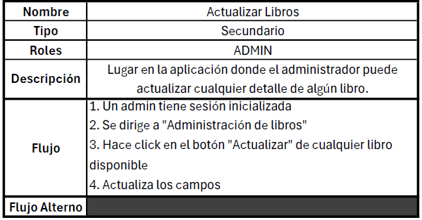

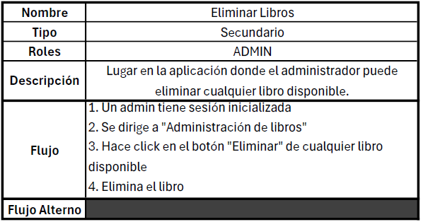

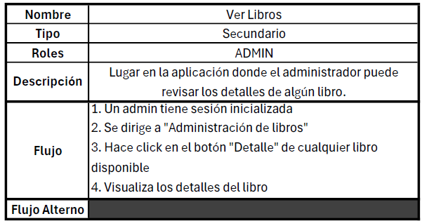

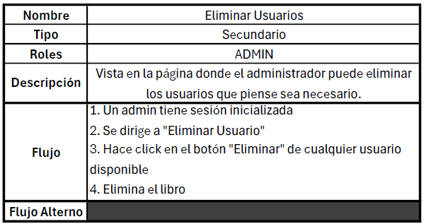

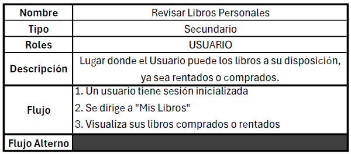

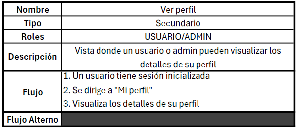

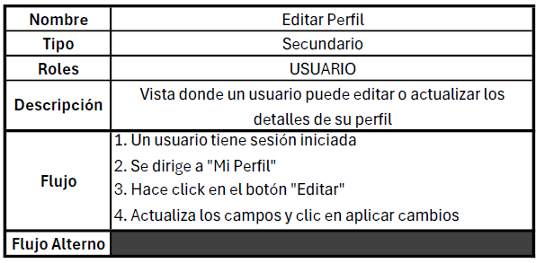

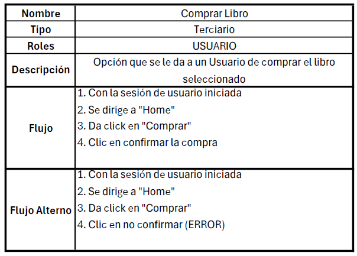

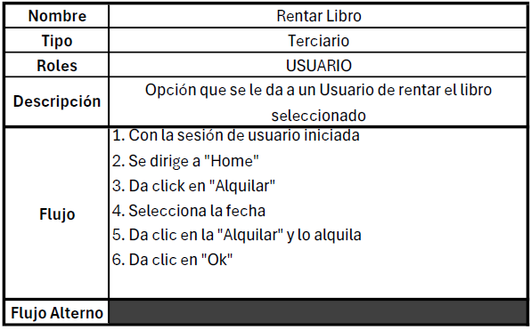

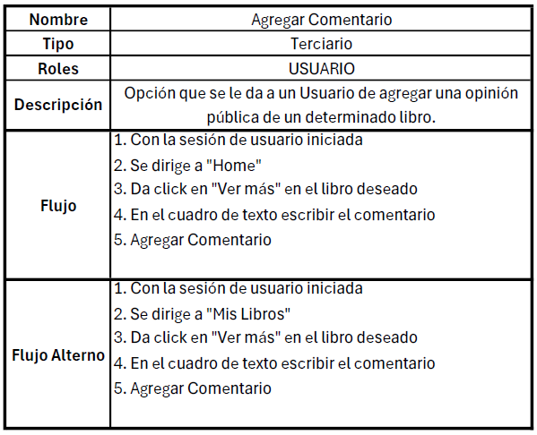

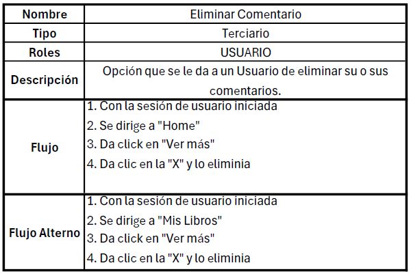

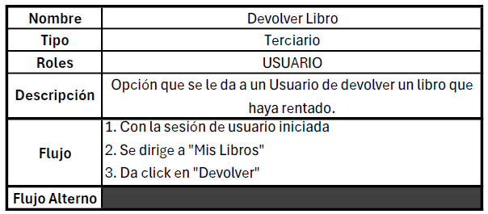
